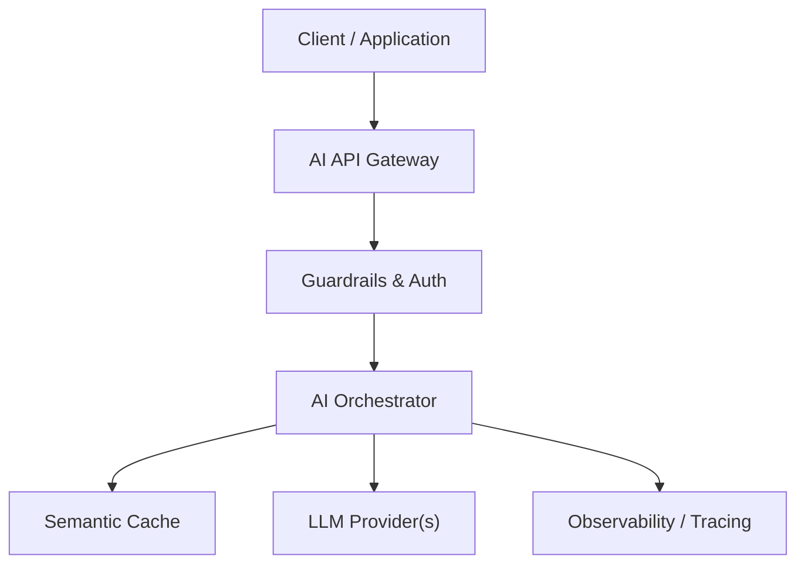

# 01 - AI Application Architecture — System Architecture & Design Specification

## Overview
End-to-end architecture of AI-powered applications: client layer, orchestrator, model gateways, vector stores, and async workers.

---

## 🏗️ Architectural Design

---

## 📊 Trade-Offs & Decisions
| Decision | Pros | Cons | Recommendation |
|---|---|---|---|
| Approach A | | | |
| Approach B | | | |

