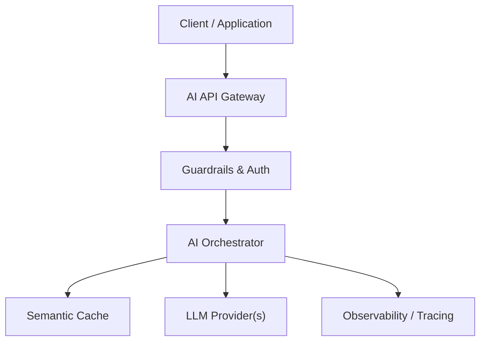

# 11 - Scaling AI Applications — System Architecture & Design Specification

## Overview
Horizontal scaling, background job queues (Celery, ARQ, Redis Streams) for long-running LLM workflows and batch processing.

---

## 🏗️ Architectural Design

---

## 📊 Trade-Offs & Decisions
| Decision | Pros | Cons | Recommendation |
|---|---|---|---|
| Approach A | | | |
| Approach B | | | |

