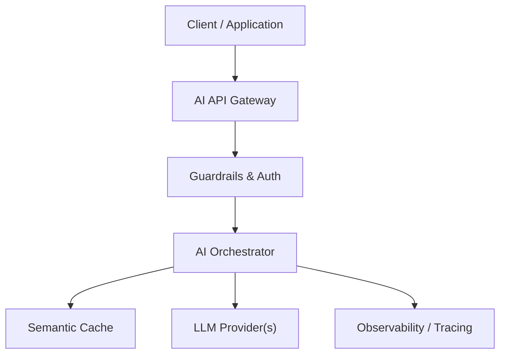

# 12 - Multi-Tenant AI Systems — System Architecture & Design Specification

## Overview
Data isolation, per-tenant vector indices/namespaces, tenant-specific quotas, billing, and custom system prompts.

---

## 🏗️ Architectural Design

---

## 📊 Trade-Offs & Decisions
| Decision | Pros | Cons | Recommendation |
|---|---|---|---|
| Approach A | | | |
| Approach B | | | |

