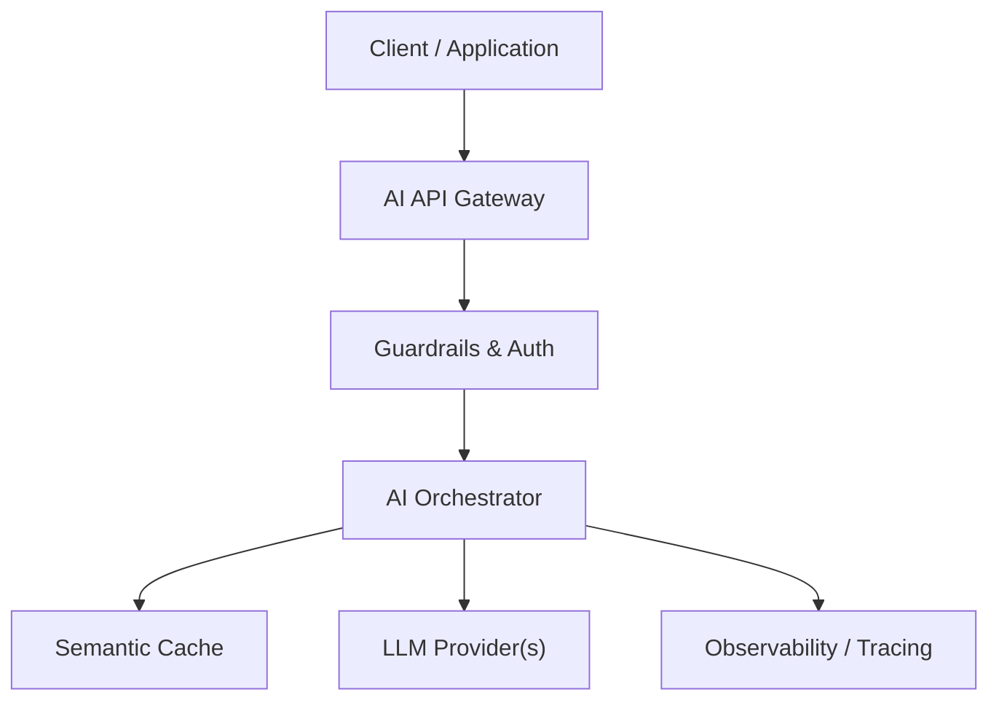

# 13 - Production Architecture Blueprint — System Architecture & Design Specification

## Overview
Complete enterprise-grade production AI system architecture incorporating all system design components.

---

## 🏗️ Architectural Design

---

## 📊 Trade-Offs & Decisions
| Decision | Pros | Cons | Recommendation |
|---|---|---|---|
| Approach A | | | |
| Approach B | | | |

