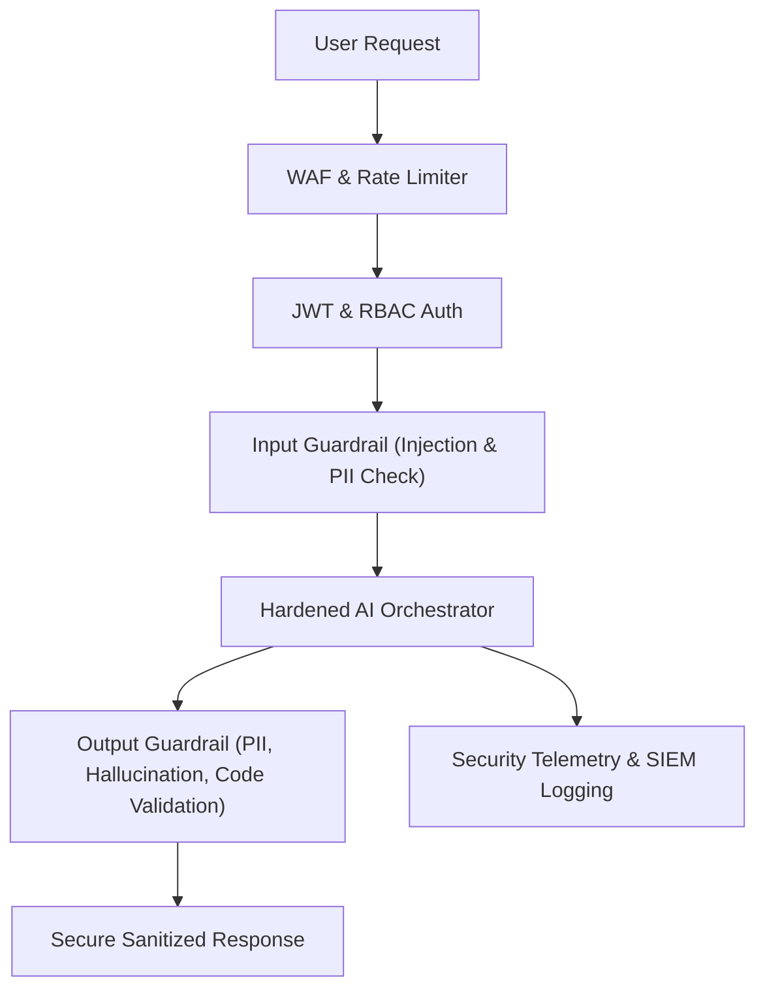

# 11 - Secure AI Architecture Blueprint — Secure Architecture Blueprint

## Defense-in-Depth Architecture

---

## Security Controls Checklist
- [ ] Input sanitization & delimiter enforcement
- [ ] Output verification & schema enforcement
- [ ] Sandboxed tool execution with read-only defaults
- [ ] Real-time injection detection and logging
