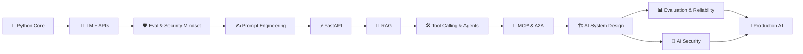

# 🧠 AI Engineering with Python

<div align="center">

### 🚀 From Backend Engineer → Production AI Engineer

**A hands-on, build-first journey through LLMs, RAG, Agents, MCP, AI System Design, Evaluation & Security.**


</div>

---

## ⚡ What is this?

This repository is my **hands-on AI Engineering journey**.

The goal is **not** to become an ML researcher or master every area of AI.

The goal is to take my existing software-engineering foundation and build the skills required to **design, build, evaluate, secure, and ship production AI applications**.

> **Learn → Code → Build → Break → Debug → Improve → Ship**

---

## 🗺️ Roadmap



### 📚 11 Core Phases

| # | Phase | Main Goal | Status |
|---|---|---|---|
| 01 | 🐍 Python Core | Python needed for AI engineering | ⬜ |
| 02 | 🧠 LLM + API Fundamentals | Understand and use LLM APIs | ⬜ |
| 03 | 🛡️ Evaluation & Security Mindset | Learn to think about AI failures | ⬜ |
| 04 | ✍️ Prompt Engineering | Build reliable, structured prompts | ⬜ |
| 05 | ⚡ FastAPI | Expose AI capabilities as services | ⬜ |
| 06 | 🔎 RAG Systems | Build knowledge-grounded AI | ⬜ |
| 07 | 🛠️ Tool Calling → AI Agents | Give AI tools and actions | ⬜ |
| 08 | 🔌 MCP & A2A | Connect tools, systems and agents | ⬜ |
| 09 | 🏗️ AI Application System Design | Design production AI architectures | ⬜ |
| 10 | 📊 AI Evaluation & Reliability | Measure and improve AI quality | ⬜ |
| 11 | 🔐 AI Security | Secure production AI systems | ⬜ |

> **⬜ Not started · 🟡 In progress · ✅ Completed**

---

## 🧩 Repository Structure

```text
ai-engineering-python/
│
├── README.md
│
├── 01-python-core/
├── 02-llm-api-fundamentals/
├── 03-evaluation-security-mindset/
├── 04-prompt-engineering/
├── 05-fastapi/
├── 06-rag/
├── 07-tools-agents/
├── 08-mcp-a2a/
├── 09-ai-system-design/
├── 10-evaluation-reliability/
├── 11-ai-security/
│
├── projects/
│   ├── phase-projects/
│   └── capstone/
│
├── notes/
│   ├── concepts/
│   ├── architecture/
│   └── mistakes/
│
└── experiments/
    └── playground/
```

> **Structure is a starting point.** Folders can evolve as the projects become more complex.

---

## 🧪 How I Will Learn

Every important concept should move through this loop:

```text
📖 Learn
   ↓
💻 Practice
   ↓
🧪 Experiment
   ↓
🏗️ Build
   ↓
💥 Break
   ↓
🔧 Improve
   ↓
🚀 Ship
```

### Rules

- **Don't just read a topic. Write code for it.**
- **Don't just copy a project. Rebuild it yourself.**
- **Don't hide failures. Record them.**
- **Don't optimize for knowing everything. Optimize for building useful systems.**

---

## 🏗️ Project Philosophy

Each phase should produce something tangible:

| Phase | Practical Output |
|---|---|
| Python | Small Python utilities + exercises |
| LLM APIs | LLM-powered CLI/API |
| Prompt Engineering | Tested prompt collection |
| FastAPI | AI backend service |
| RAG | Knowledge-grounded application |
| Agents | Tool-using agent |
| MCP/A2A | Protocol-based integrations |
| System Design | Production architecture designs |
| Evaluation | Automated AI evaluation pipeline |
| Security | Security-tested AI application |
| Capstone | End-to-end production-oriented AI system |

---

## 🎯 Core Principles

### 🧠 Engineering over hype
Understand **why** a component exists before adding it.

### 🔬 Experiment over assumption
If something behaves unexpectedly, create a small experiment and find out why.

### 📊 Measure AI behavior
A response returning `200 OK` does **not** mean the AI system worked correctly.

### 🔐 Treat AI output as untrusted
Validate model outputs before they influence important application behavior.

### 💰 Think about cost
Tokens, model selection, caching, latency and provider choices all affect production economics.

### ⚙️ Reuse existing engineering skills
Backend architecture, APIs, Docker, Kubernetes, AWS, databases, distributed systems and system design remain valuable.

---

## 📈 Progress

```text
Python Core             ⬜  0%
LLM + APIs              ⬜  0%
Eval/Security Mindset   ⬜  0%
Prompt Engineering      ⬜  0%
FastAPI                 ⬜  0%
RAG                     ⬜  0%
Agents                  ⬜  0%
MCP + A2A               ⬜  0%
AI System Design        ⬜  0%
Evaluation/Reliability  ⬜  0%
AI Security             ⬜  0%
```

> Progress will be updated as the repository grows.

---

## 🚀 Final Destination

By the end of this repository, I want to be able to take an AI product requirement and reason about the **entire system**:

```text
User
 │
 ▼
API / Application
 │
 ├──────────────► Authentication / Authorization
 │
 ▼
AI Orchestrator
 │
 ├──► Prompt / Context
 ├──► RAG ──► Vector Store
 ├──► Tools ──► APIs / DB / Services
 ├──► Agents
 └──► LLM Provider(s)
          │
          ▼
      Guardrails
          │
          ▼
       Response
          │
          ├──► Evaluation
          ├──► Tracing
          ├──► Cost
          ├──► Latency
          └──► Security
```

### The goal is simple:

> **Don't just learn AI. Learn to engineer AI systems.** 🤖⚙️

---

## 📌 Later / Optional Depth

The core journey intentionally does **not** require mastering everything in AI.

After the core roadmap, deeper areas can be explored based on the problems encountered:

- 🔬 Vector database internals
- ☁️ Large-scale cloud deployment
- 🎛️ Fine-tuning
- 🧠 Deeper model internals
- 🔭 Other specialized AI domains

These are **extensions**, not prerequisites for completing the core AI Engineering journey.

---

## ⭐ Personal Commitment

This repository is a record of the journey — **code, experiments, projects, failures, fixes, and lessons learned.**

If a concept is difficult:

**slow down → build a smaller example → understand it → continue.**

If a tool becomes popular:

**learn the underlying concept first → then learn the tool.**

If something breaks:

**debug it instead of hiding it.**

---

<div align="center">

### 🐍 → 🧠 → 🔎 → 🛠️ → 🔌 → 🏗️ → 📊 → 🔐 → 🚀

**Build. Break. Learn. Ship.**

</div>
