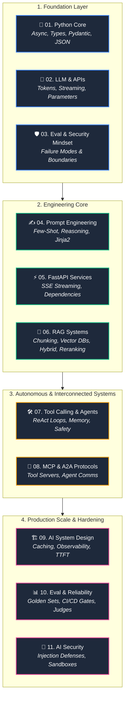

<div align="center">

# ⚡ AI Engineering with Python ⚡
### *From Backend Engineer to Production AI Systems Architect*

<p align="center">
  <b>A comprehensive, code-first roadmap mastering LLMs, RAG, Autonomous Agents, MCP, AI System Design, Automated Evaluation, and AI Security.</b>
</p>

<!-- Badges -->
<p align="center">
  <a href="https://www.python.org/"></a>
  <a href="https://fastapi.tiangolo.com/"></a>
  <a href="https://github.com/anthropics"></a>
  <a href="https://owasp.org/www-project-top-10-for-large-language-model-applications/"></a>
  <a href="#-learning-progress"></a>
  <a href="LICENSE"></a>
</p>

<p align="center">
  <a href="#-interactive-roadmap">🗺️ Roadmap</a> •
  <a href="#-the-11-core-phases">📚 11 Phases</a> •
  <a href="#-how-this-is-different">💡 Why This?</a> •
  <a href="#-repository-blueprint">📂 Repository Structure</a> •
  <a href="#-quick-start">🚀 Quickstart</a>
</p>

---

<p align="center">
  <b>⭐ If you find this roadmap helpful, please give it a star! It helps more engineers discover production-grade AI engineering. ⭐</b>
</p>

</div>

---

## 💡 Why This Repository Exists

Most AI tutorials stop at calling `openai.ChatCompletion.create()` or throwing raw text into a naive vector store. 

In production, **a `200 OK` does not mean the system works**. AI Engineering requires software engineering discipline:

| ❌ The Tutorial Way | ✅ The Production AI Engineer Way |
|---|---|
| Blind prompt concatenation | Structured templates with validation & JSON schemas |
| Simple `max_tokens` calls | Token cost tracking, rate-limiters & fallback models |
| Naive similarity search | Hybrid search (BM25 + Dense) + Cross-Encoder Reranking |
| Unrestricted LLM loops | Sandboxed ReAct agents with loop breakers & state memory |
| Custom ad-hoc integrations | Standardized **Model Context Protocol (MCP)** & A2A |
| "It looks good to me" | Automated regression pipelines, golden datasets & LLM-as-a-judge |
| Ignoring prompt injections | STRIDE Threat Modeling, PII redaction & multi-layered guardrails |

---

## 🗺️ Interactive Roadmap



---

## 📚 The 11 Core Phases

<details open>
<summary><b>🐍 Phase 01: Python Core for AI Engineering (15 Topics)</b></summary>
<br>

> Master the modern Python skills required for AI engineering — no data science fluff.

| Module | Core Topics | Status |
|---|---|:---:|
| [01. Python Fundamentals](./01-python-core/01-python-fundamentals) | Formatted strings, operators, conditionals, loops, flow control | ⬜ |
| [02. Python Data Structures](./01-python-core/02-python-data-structures) | Lists, dictionaries, sets, tuples, list comprehensions, slicing | ⬜ |
| [03. Functions & Pythonic Code](./01-python-core/03-functions) | `*args`, `**kwargs`, lambdas, higher-order functions, scopes | ⬜ |
| [04. OOP Basics](./01-python-core/04-oop-basics) | Classes, inheritance, composition, AI client models | ⬜ |
| [05. Type Hints](./01-python-core/05-type-hints) | `typing`, `TypedDict`, `Callable`, `Union`, `Literal`, static validation | ⬜ |
| [06. Error Handling](./01-python-core/06-error-handling) | `try/except/finally`, custom exceptions, API resilience | ⬜ |
| [07. Modules & Packages](./01-python-core/07-modules-packages) | Organizing packages, `__init__.py`, import management | ⬜ |
| [08. Virtual Environments](./01-python-core/08-virtual-environments-package-management) | `venv`, `pip`, modern dependency management | ⬜ |
| [09. JSON](./01-python-core/09-json) | Serializing, parsing, extracting deep nested LLM responses | ⬜ |
| [10. File I/O](./01-python-core/10-file-io) | Context managers, `pathlib.Path`, streaming document loaders | ⬜ |
| [11. HTTP & API Calls](./01-python-core/11-http-api-calls) | `requests`, `httpx`, headers, auth, exponential backoffs | ⬜ |
| [12. Async Python](./01-python-core/12-async-python) | `asyncio`, `async/await`, concurrent task pipelines | ⬜ |
| [13. Decorators](./01-python-core/13-decorators) | Function decorators, `@wraps`, timing, telemetry, retry decorators | ⬜ |
| [14. Env Variables & Config](./01-python-core/14-environment-variables-configuration) | `os.getenv`, `python-dotenv`, secrets management, validation | ⬜ |
| [15. Pydantic](./01-python-core/15-pydantic) | `BaseModel`, `Field` validation, serialization for AI schemas | ⬜ |

</details>

<details open>
<summary><b>🧠 Phase 02: LLM + API Fundamentals (12 Topics + 4 Projects)</b></summary>
<br>

> Master model parameters, token economics, streaming architectures, and provider SDKs.

- 📖 **Topics**: [01. LLM Fundamentals](./02-llm-api-fundamentals/01-llm-fundamentals) • [02. Tokens & Tokenization](./02-llm-api-fundamentals/02-tokens) • [03. Context Windows](./02-llm-api-fundamentals/03-context-windows) • [04. Messages & Roles](./02-llm-api-fundamentals/04-messages-roles) • [05. API Requests](./02-llm-api-fundamentals/05-llm-api-requests) • [06. API Responses](./02-llm-api-fundamentals/06-llm-api-responses) • [07. Temperature](./02-llm-api-fundamentals/07-temperature) • [08. Top-P](./02-llm-api-fundamentals/08-top-p) • [09. Streaming (SSE)](./02-llm-api-fundamentals/09-streaming) • [10. Structured Outputs](./02-llm-api-fundamentals/10-structured-outputs) • [11. API Reliability](./02-llm-api-fundamentals/11-api-errors-reliability) • [12. Token Cost Awareness](./02-llm-api-fundamentals/12-token-cost-awareness)
- 🛠️ **Projects**:
  - `01-llm-playground/`: Interactive multi-provider CLI playground.
  - `02-llm-api-client/`: Robust multi-provider typed client SDK.
  - `03-streaming-chat/`: Low-latency real-time streaming terminal chat.
  - `04-phase-2-capstone/`: Enterprise LLM Gateway with automatic fallback & cost metering.

</details>

<details open>
<summary><b>🛡️ Phase 03: Evaluation & Security Mindset (4 Topics)</b></summary>
<br>

> Learn how to reason about non-determinism, failure surfaces, and safety perimeters.

- 📖 **Topics**: [01. Evaluation Mindset](./03-evaluation-security-mindset/01-evaluation-mindset) • [02. Reliability Mindset](./03-evaluation-security-mindset/02-reliability-mindset) • [03. Security Mindset](./03-evaluation-security-mindset/03-security-mindset) • [04. AI Boundaries](./03-evaluation-security-mindset/04-ai-application-boundaries)

</details>

<details open>
<summary><b>✍️ Phase 04: Prompt Engineering (7 Topics + Lab)</b></summary>
<br>

> Move from informal chatting to programmatic, test-driven prompt architectures.

- 📖 **Topics**: [01. Prompt Fundamentals](./04-prompt-engineering/01-prompt-fundamentals) • [02. Zero-Shot](./04-prompt-engineering/02-zero-shot) • [03. Few-Shot In-Context Learning](./04-prompt-engineering/03-few-shot) • [04. System Prompt Design](./04-prompt-engineering/04-system-prompt-design) • [05. Dynamic Templates](./04-prompt-engineering/05-prompt-templates) • [06. Reasoning Patterns (CoT)](./04-prompt-engineering/06-practical-reasoning-patterns) • [07. Prompt Regression Testing](./04-prompt-engineering/07-prompt-iteration-testing)
- 🛠️ **Project**: `prompt-evaluation-lab/`: Automated prompt benchmark harness and evaluation suite.

</details>

<details open>
<summary><b>⚡ Phase 05: FastAPI Services (9 Topics + 3 Projects)</b></summary>
<br>

> Expose AI models via high-throughput, async-first web APIs.

- 📖 **Topics**: [01. FastAPI Fundamentals](./05-fastapi/01-fastapi-fundamentals) • [02. Pydantic Integration](./05-fastapi/02-pydantic-fastapi) • [03. Dependency Injection](./05-fastapi/03-dependency-injection) • [04. Async Endpoints](./05-fastapi/04-async-endpoints) • [05. Application Structure](./05-fastapi/05-application-structure) • [06. Error Handling](./05-fastapi/06-error-handling) • [07. AI API Integration](./05-fastapi/07-ai-api-integration) • [08. Streaming Responses (SSE)](./05-fastapi/08-streaming-responses) • [09. Production Middleware](./05-fastapi/09-basic-production-concerns)
- 🛠️ **Projects**:
  - `01-basic-fastapi-service/`: Robust REST service with complete OpenAPI contracts.
  - `02-ai-api-service/`: Production AI backend service with auth, retries, and schemas.
  - `03-ai-chat-api/`: Full-featured streaming chat backend with SSE and message state.

</details>

<details open>
<summary><b>🔎 Phase 06: RAG Systems (12 Topics + 3 Projects)</b></summary>
<br>

> Build knowledge-grounded AI applications with hybrid search, embeddings, and reranking.

- 📖 **Topics**: [01. RAG Fundamentals](./06-rag/01-rag-fundamentals) • [02. Document Loading](./06-rag/02-document-loading) • [03. Chunking Strategies](./06-rag/03-chunking) • [04. Embeddings](./06-rag/04-embeddings) • [05. Vector DBs](./06-rag/05-vector-databases) • [06. Similarity Math](./06-rag/06-similarity-search) • [07. Retrieval Pipeline](./06-rag/07-retrieval-pipeline) • [08. Hybrid Search (BM25 + Dense)](./06-rag/08-hybrid-search) • [09. Cross-Encoder Reranking](./06-rag/09-reranking) • [10. Context Injection](./06-rag/10-generation-and-context) • [11. RAG Evaluation (Ragas)](./06-rag/11-rag-quality) • [12. RAG Security](./06-rag/12-rag-security)
- 🛠️ **Projects**:
  - `01-basic-rag/`: End-to-end in-memory RAG pipeline.
  - `02-hybrid-rag/`: Sparse/dense retrieval with reciprocal rank fusion (RRF).
  - `03-production-rag/`: Enterprise RAG microservice with persistent vector store & security checks.

</details>

<details open>
<summary><b>🛠️ Phase 07: Tool Calling → AI Agents (11 Topics + 3 Projects)</b></summary>
<br>

> Build autonomous agents capable of dynamic reasoning, tool execution, and self-healing.

- 📖 **Topics**: [01. Tool Calling Fundamentals](./07-tools-agents/01-tool-calling-fundamentals) • [02. Tool Calling Flow](./07-tools-agents/02-tool-calling-flow) • [03. Function Execution](./07-tools-agents/03-function-calling) • [04. Tool Schema Design](./07-tools-agents/04-tool-design) • [05. Execution Safety & Sandboxing](./07-tools-agents/05-tool-execution-safety) • [06. Agent Fundamentals](./07-tools-agents/06-agent-fundamentals) • [07. ReAct Loops & Termination](./07-tools-agents/07-agent-loops) • [08. Memory & State Scratchpads](./07-tools-agents/08-agent-memory-state) • [09. Multi-Tool Orchestration](./07-tools-agents/09-multi-tool-agents) • [10. Self-Healing & Error Recovery](./07-tools-agents/10-agent-reliability) • [11. Hierarchical Architectures](./07-tools-agents/11-agent-architecture)
- 🛠️ **Projects**:
  - `01-tool-calling-agent/`: Single-agent assistant with dynamic calculator/search tools.
  - `02-multi-tool-agent/`: Multi-tool agent with persistent scratchpad memory.
  - `03-production-agent/`: Production ReAct agent with sandboxed execution & rate limiting.

</details>

<details open>
<summary><b>🔌 Phase 08: MCP & A2A Protocols (10 Topics + 3 Projects)</b></summary>
<br>

> Connect AI agents to tools, resources, and each other using open standard protocols.

- 📖 **Topics**: [01. MCP Fundamentals](./08-mcp-a2a/01-mcp-fundamentals) • [02. MCP Tools](./08-mcp-a2a/02-mcp-tools) • [03. MCP Resources](./08-mcp-a2a/03-mcp-resources) • [04. MCP Prompts](./08-mcp-a2a/04-mcp-prompts) • [05. FastMCP Server](./08-mcp-a2a/05-mcp-server) • [06. MCP Client Integration](./08-mcp-a2a/06-mcp-client) • [07. MCP Security Boundaries](./08-mcp-a2a/07-mcp-security) • [08. A2A Fundamentals](./08-mcp-a2a/08-a2a-fundamentals) • [09. Inter-Agent Communication](./08-mcp-a2a/09-agent-communication) • [10. MCP vs A2A](./08-mcp-a2a/10-mcp-vs-a2a)
- 🛠️ **Projects**:
  - `01-mcp-tool-server/`: FastMCP tool server exposing database and system utilities.
  - `02-mcp-resource-server/`: Resource server serving live documentation and system telemetry.
  - `03-multi-agent-mcp-a2a/`: Distributed multi-agent ecosystem collaborating via A2A.

</details>

<details open>
<summary><b>🏗️ Phase 09: AI System Design (13 Topics)</b></summary>
<br>

> Design large-scale, cost-effective, low-latency, and multi-tenant AI systems.

- 📖 **Topics**: [01. Architecture Blueprints](./09-ai-system-design/01-ai-application-architecture) • [02. AI Service Design](./09-ai-system-design/02-ai-service-design) • [03. Model Provider Gateways](./09-ai-system-design/03-model-provider-management) • [04. Semantic Caching](./09-ai-system-design/04-semantic-caching) • [05. Rate Limiting & Token Quotas](./09-ai-system-design/05-rate-limiting-quotas) • [06. Guardrails & Moderation](./09-ai-system-design/06-ai-guardrails) • [07. Observability & Tracing](./09-ai-system-design/07-ai-observability) • [08. Cost Management](./09-ai-system-design/08-cost-management) • [09. Latency & TTFT Optimization](./09-ai-system-design/09-latency-management) • [10. Reliability & Circuit Breakers](./09-ai-system-design/10-reliability-failure-handling) • [11. Horizontal Scaling & Queues](./09-ai-system-design/11-scaling-ai-applications) • [12. Multi-Tenant AI Systems](./09-ai-system-design/12-multi-tenant-ai) • [13. Production Architecture Capstone](./09-ai-system-design/13-production-architecture)

</details>

<details open>
<summary><b>📊 Phase 10: AI Evaluation & Reliability (11 Topics + Platform)</b></summary>
<br>

> Implement automated regression testing, continuous benchmarking, and quality gates.

- 📖 **Topics**: [01. Evaluation Fundamentals](./10-evaluation-reliability/01-evaluation-fundamentals) • [02. Quantitative Metrics](./10-evaluation-reliability/02-evaluation-metrics) • [03. Golden Datasets](./10-evaluation-reliability/03-evaluation-datasets) • [04. LLM-as-a-Judge Rubrics](./10-evaluation-reliability/04-llm-as-a-judge) • [05. RAG Evaluation](./10-evaluation-reliability/05-rag-evaluation) • [06. Agent Trajectory Evaluation](./10-evaluation-reliability/06-agent-evaluation) • [07. Regression CI/CD Suites](./10-evaluation-reliability/07-regression-testing) • [08. Traces & Feedback Loops](./10-evaluation-reliability/08-observability-tracing) • [09. Chaos Testing & Failure Probing](./10-evaluation-reliability/09-reliability-engineering) • [10. Production Drift Monitoring](./10-evaluation-reliability/10-production-monitoring) • [11. Release Pipeline Gates](./10-evaluation-reliability/11-evaluation-release-pipeline)
- 🛠️ **Project**: `ai-evaluation-platform/`: Automated evaluation platform with dataset benchmark runners and quality gates.

</details>

<details open>
<summary><b>🔐 Phase 11: AI Security (11 Topics)</b></summary>
<br>

> Harden AI architectures against prompt injection, data exfiltration, and supply chain threats.

- 📖 **Topics**: [01. Threat Modeling (STRIDE / OWASP)](./11-ai-security/01-security-fundamentals) • [02. Prompt Injection (Direct & Indirect)](./11-ai-security/02-prompt-injection) • [03. Data Leakage & PII Redaction](./11-ai-security/03-data-leakage) • [04. RAG Document Poisoning](./11-ai-security/04-rag-security) • [05. Tool & Agent Security](./11-ai-security/05-tool-agent-security) • [06. Authentication & RBAC](./11-ai-security/06-authentication-authorization) • [07. Model Supply Chain Security](./11-ai-security/07-ai-supply-chain-security) • [08. Output Security & Sanitization](./11-ai-security/08-output-security) • [09. Denial of Wallet & Abuse Defense](./11-ai-security/09-abuse-resource-protection) • [10. Real-time Security Monitoring](./11-ai-security/10-ai-security-monitoring) • [11. Hardened Architecture Blueprint](./11-ai-security/11-secure-ai-architecture)

</details>

---

## 📂 Repository Blueprint

```text
ai-engineering-python/
│
├── README.md                                          # Master Roadmap & Documentation
│
├── 01-python-core/                                    # 🐍 Phase 01: Core Python
│   ├── 01-python-fundamentals/practice.py             # 15 Formatted Practice Questions
│   ├── 02-python-data-structures/practice.py          # 15 Formatted Practice Questions
│   ├── 03-functions/practice.py                       # 15 Formatted Practice Questions
│   ├── 04-oop-basics/practice.py                      # 12 Formatted Practice Questions
│   ├── 05-type-hints/practice.py                      # 15 Formatted Practice Questions
│   ├── 06-error-handling/practice.py                  # 12 Formatted Practice Questions
│   ├── 07-modules-packages/practice.py                # 10 Formatted Practice Questions
│   ├── 08-virtual-environments-package-management/    # 10 Formatted Practice Questions
│   ├── 09-json/practice.py                            # 12 Formatted Practice Questions
│   ├── 10-file-io/practice.py                         # 10 Formatted Practice Questions
│   ├── 11-http-api-calls/practice.py                  # 20 Formatted Practice Questions
│   ├── 12-async-python/practice.py                    # 20 Formatted Practice Questions
│   ├── 13-decorators/practice.py                      # 10 Formatted Practice Questions
│   ├── 14-environment-variables-configuration/        # 10 Formatted Practice Questions
│   └── 15-pydantic/practice.py                        # 15 Formatted Practice Questions
│
├── 02-llm-api-fundamentals/                           # 🧠 Phase 02: LLMs & APIs
│   ├── 01-llm-fundamentals/ to 12-token-cost/        # (README.md, practice.py, experiments.py)
│   └── projects/                                      # Playground, Client SDK, Streaming Chat
│
├── 03-evaluation-security-mindset/                    # 🛡️ Phase 03: Mindset & Boundaries
│   └── 01-evaluation-mindset/ to 04-boundaries/       # (README.md, practice.py, experiments.py)
│
├── 04-prompt-engineering/                            # ✍️ Phase 04: Prompt Engineering
│   ├── 01-fundamentals/ to 07-testing/               # (README.md, practice.md/py, experiments)
│   └── projects/prompt-evaluation-lab/                # Automated Regression Suite
│
├── 05-fastapi/                                       # ⚡ Phase 05: FastAPI Services
│   ├── 01-fundamentals/ to 09-production/            # (README.md, practice.py / practice/)
│   └── projects/                                      # Basic Service, AI API, SSE Chat API
│
├── 06-rag/                                           # 🔎 Phase 06: RAG Systems
│   ├── 01-fundamentals/ to 12-security/              # Hybrid search, reranking, vectors
│   └── projects/                                      # In-Memory RAG, Hybrid RAG, Prod RAG
│
├── 07-tools-agents/                                  # 🛠️ Phase 07: Tools & ReAct Agents
│   ├── 01-tool-calling/ to 11-architecture/          # ReAct loops, state, memory, sandboxing
│   └── projects/                                      # Tool Agent, Multi-Tool, Prod Agent
│
├── 08-mcp-a2a/                                       # 🔌 Phase 08: MCP & A2A
│   ├── 01-mcp-fundamentals/ to 10-mcp-vs-a2a/        # FastMCP servers, clients, resources
│   └── projects/                                      # Tool Server, Resource Server, Multi-Agent
│
├── 09-ai-system-design/                              # 🏗️ Phase 09: AI System Design
│   └── 01-architecture/ to 13-production/            # Caching, rate limits, observability, cost
│
├── 10-evaluation-reliability/                        # 📊 Phase 10: Evaluation & Quality
│   ├── 01-fundamentals/ to 11-pipeline/              # Golden sets, LLM-as-a-judge, CI gates
│   └── projects/ai-evaluation-platform/               # Benchmark Platform
│
└── 11-ai-security/                                   # 🔐 Phase 11: Hardened AI Security
    └── 01-fundamentals/ to 11-secure-architecture/   # Injection, leakage, STRIDE threat models
```

---

## 🚀 Quick Start

### 1. Clone the repository
```bash
git clone https://github.com/Mr-manish-07/py-ai-craft.git
cd py-ai-craft
```

### 2. Set up virtual environment
```bash
python3 -m venv .venv
source .venv/bin/activate  # On Windows: .venv\Scripts\activate
```

### 3. Start with Phase 1 Practice
```bash
# Run the Python Fundamentals practice exercises
python 01-python-core/01-python-fundamentals/practice.py
```

---

## 📈 Learning Progress

```text
Phase 01: Python Core                  [░░░░░░░░░░]   0%  (0/15 Topics)
Phase 02: LLM + APIs                   [░░░░░░░░░░]   0%  (0/12 Topics)
Phase 03: Eval/Security Mindset        [░░░░░░░░░░]   0%  (0/4 Topics)
Phase 04: Prompt Engineering           [░░░░░░░░░░]   0%  (0/7 Topics)
Phase 05: FastAPI                      [░░░░░░░░░░]   0%  (0/9 Topics)
Phase 06: RAG Systems                  [░░░░░░░░░░]   0%  (0/12 Topics)
Phase 07: Tool Calling & Agents        [░░░░░░░░░░]   0%  (0/11 Topics)
Phase 08: MCP & A2A                    [░░░░░░░░░░]   0%  (0/10 Topics)
Phase 09: AI System Design             [░░░░░░░░░░]   0%  (0/13 Topics)
Phase 10: Evaluation & Reliability     [░░░░░░░░░░]   0%  (0/11 Topics)
Phase 11: AI Security                  [░░░░░░░░░░]   0%  (0/11 Topics)
```

---

<div align="center">

### ⭐ Star this repository if you find it useful!

<b>Crafted with ❤️ for software engineers leveling up to AI Engineering.</b>

<p align="center">
  <a href="https://github.com/Mr-manish-07"></a>
  <a href="https://twitter.com/"></a>
  <a href="https://linkedin.com/"></a>
</p>

</div>
